+++
title = "Dealing with Ghost Collisions"
date = "2023-10-03T10:45:26-04:00"
description = "Evaluating existing methods to solve the 2D physics ghost collision problem, and introducing a new, more flexible solution applicable for some games."
tags = ["box2d", "c++", "godot", "winterpixel", "physics"]
draft = false
+++

---

In this post I'll be explaining what the ghost collision issue is, walking through several existing ways to solve the problem, and a new solution I developed for my purposes that beats out all the solutions I've found online.

I developed this solution as part of my work at Winterpixel Games, during the early development of Goober Dash (which you can play [here](https://gooberdash.winterpixel.io)!)

As always, there are pros/cons to everything, so maybe my solution doesn't fit your project. In any case, I hope this is useful to some people and provides inspiration for new ideas.

[(Click to skip to the solution)](#a-third-solution)

## What are "ghost collisions"?

Essentially, ghost collisions are a common bug encountered when building 2D platformer games using a physics engine where your player gets stuck while walking on a surface made of multiple pieces of geometry.

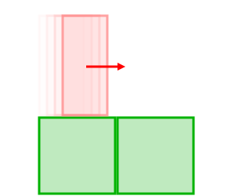 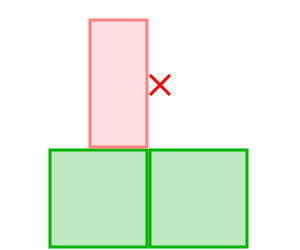

This issue doesn't occur all the time - only when the player is positioned _just right_ to get stuck on a corner.

#### But why?

Ghost collisions are caused by the nature of physics engines.
To detect a collision, two bodies must be overlapping. Once detected, the collision solver must separate the bodies by solving position and velocity constraints.

However, if not handled carefully, this can cause contact states to flicker, cycling between touching and not touching. This can cause inconsistent behavior in game logic, (e.g. detecting if the player is touching the ground before allowing them to jump). This can be resolved by introducing an overlap "slop", where you undersolve the constraints leaving the colliders _slightly_ overlapping.

As part of the collision detection, the contact **normal vector** is also calculated to provide to the solver. This normal vector is critical to how the solver behaves.

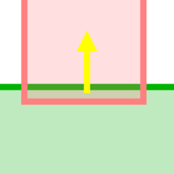 &nbsp; &nbsp; &nbsp; &nbsp; 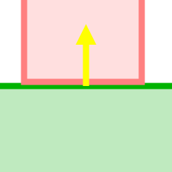

In our example scenario, while a player body slides across the ground and encounters a new collider, there are two ways that it can resolve depending on the exact player position (including overlap slop!) Let's look at both corner-collision scenarios:

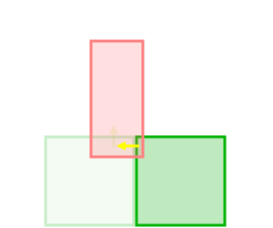\
_(overlap exaggerated for demonstration purposes)_

In the first scenario, the contact normal is pointing up, and position/velocity constraints prevent the player from falling into the ground. The player continues sliding toward the right, as expected.
In the second scenario, the contact normal is pointing horizontally, causing the solver to block the player from moving.

This is called a **ghost collision**.

## Existing solutions

I'm aware of two solutions to ghost collisions documented online. If you want to read more about them, links are provided throughout.

### Solution 1. Clipped Corners

The easiest workaround is to clip the corners of the player's collision shape. This prevents the player from getting completely stuck on corners.

Another form of the clipped corners solution is to use pill/capsule shapes for the player collision. You can also clip the corners on the terrain itself. I'm sure this workaround exists in many forms, but functionally they do the same thing.

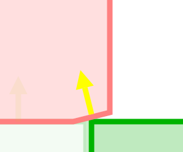 &nbsp; &nbsp; &nbsp; &nbsp; 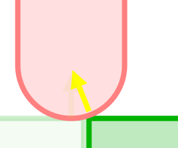

Pros:
- Very easy to implement
- Prevents the worst case scenario (the player won't get completely stuck)

Cons:
- Can cause the player to "hop" and change velocity when moving between two surfaces.
This is more noticable if the player is moving quickly, and may affect player controls when ground contact is lost (i.e. `if (jump && on_ground) {...}`)
- Players standing on a cliff edge may slowly slip, if friction is not properly accounted for.

Read more about this solution [from iforce2d](https://www.iforce2d.net/b2dtut/ghost-vertices).

### Solution 2. Box2D Chain Shapes

Box2D provides a solution to the ghost collision problem in the form of chain shapes. This is intended to solve a slightly different scenario created by two edge shapes rather than two convex polygons.

I won't explain here how chain shapes work (instead see [Erin Catto's post](https://box2d.org/posts/2020/06/ghost-collisions/)), but in summary, chain shapes allow you to specify a sequence of edges with _ghost vertices_ to define geometry for terrain, where the contact normals are calculated differently to handle this special case, preventing the player from getting hung up on corners.

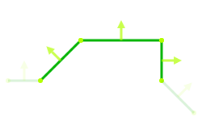

Pros:
- Actually prevents ghost collisions, instead of working around them
- Built-in solution; no extra code required (if you are using Box2D)

Cons:
- Contiguous chunks of terrain must be defined as a single chain shape. This can be difficult to work with, especially if you want to use a tilemap or other level editor that defines colliders as individual rectangles. (The most straightforward solution I can imagine is using [Clipper2](https://github.com/AngusJohnson/Clipper2) to join all the geometry with polygon clipping.)
- Chain shapes are **hollow**, meaning:
    1. They don't push players out of the ground (if players spawn inside or teleport - a common event in chaotic user-created levels), and
    2. They are more prone to tunneling if you don't have continuous collision detection enabled to handle fast moving objects.

## Why do we need another solution?

If you've worked on or even just played a platformer game before, you might already know what's missing. There are so many features we haven't considered yet where these solutions aren't sufficient.

### Requirements:

While working on Goober Dash, I needed a solution that:
1. Is performance friendly (no polygon clipping algorithms running on the server),
2. Is invisible to designers (no handcrafted colliders to duplicate level layout),
3. Doesn't create hollow terrain or weirdly affect player movement,
4. Is a no-compromises solution where the player transitions between different collision bodies (i.e. moving platforms, one-way platforms, dynamic objects and boxes, etc.)

I have yet to find any solution online that handles all of these requirements to my standard.

Requirements 1-3 are no surprise, but let's visualize this fourth requirement.

Moving platforms are a staple in platformers. Often they line up perfectly with the terrain, creating opportunity for ghost collisions. You can't raise/lower the height of the platform to prevent ghost collisions going in one direction, because then the player will surely hit a corner going the opposite way.

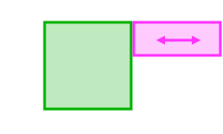

How about one-way platforms? These require custom behaviors to disable collisions depending on the player's position and velocity. The only sensible way to implement this is using separate physics bodies with linked behaviors.

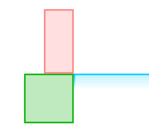

These features are critical to any platformer, and no solution I found online addressed the core of the problem.

## A Third Solution

So, how can we do better? It's actually quite simple, as long as you have collision callbacks that provide you the ability to selectively disable collisions. With Box2D we can use a [presolve callback](https://box2d.org/documentation/md__d_1__git_hub_box2d_docs_dynamics.html#autotoc_md110) to detect the ghost collision scenario and disable the collision.

We disable contacts that meet all of the following criteria:
1. The contact normal opposes the player's velocity (which could cause the player to get caught)
2. It is a face-face collision (which has two contact manifold points, so we can calculate the contact "area")
3. The calculated contact area is smaller than the maximum overlap slop.

<!-- This is what contact manifold points and "contact area" look like in Box2D:\ -->
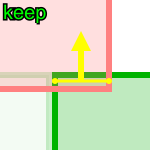 &nbsp; &nbsp; &nbsp; &nbsp; 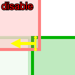

Because these contacts only have a tiny overlap, we can safely disable the collision for one frame without any noticeable error. Once the overlap between the two bodies increases (and there is a larger contact area), the collision will be re-enabled and the solver will separate the bodies.

The purpose of measuring "contact area" is because it actually represents the overlap depth between bodies if the normal vector were actually pointing upward as it should. This allows us to compare it to the overlap slop and temporarily ignore the collision.

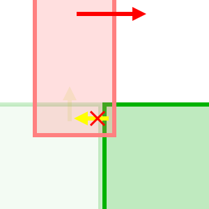

Here's the code:
```cpp
void PreSolve(b2Contact* contact, const b2Manifold* oldManifold) {
    b2WorldManifold worldManifold;
    contact->GetWorldManifold(&worldManifold);
    const b2Body* body_a = contact->GetFixtureA()->GetBody();
    const b2Body* body_b = contact->GetFixtureB()->GetBody();

    // Check if this is a player collision and orient the contact normal
    b2Body* player_body;
    b2Vec2 normal = worldManifold.normal; // oriented terrain -> player
    if (body_a->GetUserData().isPlayer) {
        player_body = body_a;
    } else if (body_b->GetUserData().isPlayer) {
        player_body = body_b;
        normal = -normal;
    }
    if (!player_body) return;

    // Prevent snags (ghost collisions) for face-face collisions
    if (b2Dot(normal, player_body->GetLinearVelocity()) >= 0.0) {
        if (worldManifold.pointCount > 1) {
            // our threshold needs to be at least `2.0 * b2_linearSlop`
            // (which is the deepest overlap we should ever encounter)
            // to be extra safe let's double it
            constexpr float overlap_slop = 4.0 * b2_linearSlop;

            float contact_area = (worldManifold.points[0] - worldManifold.points[1]).Length();
            // if contact_area > threshold, then this is a wall, not a ghost collision
            if (contact_area < overlap_slop) {
                contact.SetEnabled(false); // only disabled for 1 frame
            }
        }
    }
}
```
_(This code is partially copy-pasted from our project and then modified for this post, and therefore might have errors.)_

Let me know if I got anything wrong, or if you've come across this solution before.\
I hope this writeup helps.

**Notes:**
- This approach might work for other platformer problems, like [fudging corner collisions](https://twitter.com/MaddyThorson/status/1238338579513798656). I suspect my implementation could be adapted by simply increasing the overlap slop threshold.
- I haven't designed this for anything other than axis-aligned rectangles. You may still encounter ghost collisions with point-face contacts. I have a hunch that there is an alternate approach based on overlap instead of contact area, e.g.:
```cpp
    // alternate method? (untested)
    // requires head-on collisions to overlap slightly more before enabling them
    b2Vec2 player_dir = player_body->GetLinearVelocity();
    player_dir.Normalize();
    float separation = worldManifold.pointCount > 1 ? (worldManifold.separations[0]+worldManifold.separations[1])*0.5 : worldManifold.separations[0];
    if (-separation < 2.0*b2_linearSlop * b2Dot(-normal, player_dir)) { 
        contact.SetEnabled(false);
    }
```

---

_Contact me: brian(dot)semrau(dot)dev(at)gmail_

---