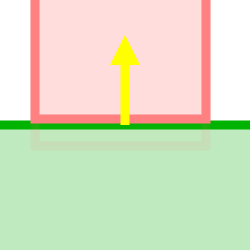
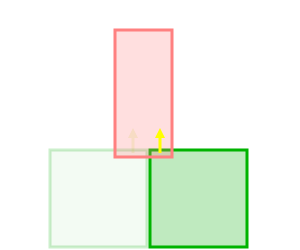

+++
title = "Dealing with Ghost Collisions"
date = "2023-10-03T10:45:26-04:00"
description = "Evaluating existing methods to solve the 2D physics ghost collision problem, and a new solution I've come up with that I think is better."
tags = ["box2d", "c++", "godot", "winterpixel", "goober dash"]
draft = false
+++

---

In this post I'll be explaining what the ghost collision issue is, walking through several existing ways to solve the problem, and a new solution I've come up with that I think is better than everything I've found online.

I developed this solution as part of my work at Winterpixel Games, during the early development of Goober Dash (which you can play [here](https://gooberdash.winterpixel.io)!)

As always, there are caveats and pros/cons to everything from  to combustion engines, so maybe my new solution isn't perfect for your project. But hopefully I can expand on the literature and provide something new.

[Skip to The Solution](#a-third-solution)

## What are "ghost collisions"?

Essentially, ghost collisions are a common bug encountered when building 2D platformer games using a physics engine where your player gets stuck while walking on a surface made of multiple pieces of geometry.

 

This issue doesn't occur all the time - only when the player is positioned _just right_ to get stuck on a corner.

#### But why?

Ghost collisions are caused by the nature of physics engine discrete collision detection and resolution. To detect a collision, two bodies must be overlapping. This happens constantly while a player is walking along a surface with gravity pushing down. The player's physics body is constantly pushing into the ground, and the solver is constantly pushing the player back up, correcting both position and velocity. This collision resolution is dictated by the contact **normal vector**, which is calculated from the geometry and positions of the two colliding bodies.

 &nbsp; &nbsp; &nbsp; &nbsp; 

While a body slides across the surface and encounters a new collider, there is a chance that the bodies overlap such that the calculated contact normal is not what you expect. Let's look at two possible corner collision scenarios:

<!-- \
_The corner collision scenario. (image from iforce2d)_ -->

\
_(overlap exaggerated for demonstration purposes)_

In the first, the contact normal is pointing up, and the player continues sliding as expected. In the second, the contact normal is pointing horizontally, blocking the player from moving.

This is called a **ghost collision**.

<!-- **Note:**\
For the context of this post, I want to clarify that we're working with rigid body player controllers. It is common to instead use kinematic bodies, handling all the collision mechanics yourself, but I'm not a fan of this method for plenty of reasons. At Winterpixel Games, we were able to successfully create a tight, responsive, and fun player controller using exclusively rigid bodies. This was necessary because our games involve interactive multiplayer with a lot of natural physics interactions, such as pushing blocks and other players around. -->

## Existing solutions

I'm aware of two solutions to ghost collisions documented online. If you want to read more about them, links are provided throughout.

### Solution 1. Clipped Corners

The easiest solution is to clip the corners of the player's collision shape. This prevents the player from getting completely stuck on corners.

Another form of the clipped corners solution is to use pill, or capsule shapes for the player collision.

<!-- \
_(image from iforce2d)_ -->
 &nbsp; &nbsp; &nbsp; &nbsp; 

Pros:
- Very simple to implement
- Prevents the worst case scenario (player completely stuck)

Cons:
- Can cause the player to "hop" and change velocity when moving between two surfaces.
This is more noticable if the player is moving quickly, and may affect player controls (i.e. `if (jump && on_ground) {...}`)
- Players standing on the edge of a surface may slip off the edge, if friction is not properly accounted for.

Read more about this solution [from iforce2d](https://www.iforce2d.net/b2dtut/ghost-vertices).

### Solution 2. Box2D Chain Shapes

Box2D provides a solution to the ghost collision problem in the form of chain shapes. This is intended to solve a slightly different scenario created by two edge shapes rather than two convex polygons.

I won't explain here how chain shapes work (instead see [Erin Catto's blog](https://box2d.org/posts/2020/06/ghost-collisions/)), but in summary, chain shapes allow you to specify a sequence of edges with **ghost vertices** to define geometry for terrain, where the contact normals are calculated differently to handle this special case, preventing the player from getting hung up on corners.


Pros:
- Handles ghost collisions
- Built-in solution, no extra code required (if using Box2D)

Cons:
- Contiguous chunks of terrain must be defined as a single chain shape. This can be difficult to work with, especially if you want to use a tilemap or other level editor. (The most straightforward solution I can imagine is using [Clipper2](https://github.com/AngusJohnson/Clipper2) to join all the geometry with polygon clipping.)
- Chain shapes are **hollow**, meaning:
    1. They don't push players out of the ground (if players spawn inside or teleport - common in user created levels), and
    2. They are more prone to tunneling if you don't have continuous collision detection enabled to handle fast moving objects.

<!-- ### Solution 3. Polygon clipping

As just mentioned, you can join geometry together using polygon clipping. This is a very powerful solution, but requires another dependency and can have performance implications.

You don't have to use chain shapes for this. You can instead use convex polygons if you spend the effort to decompose concave N-gons into convex 8-gons as I have implemented [here](https://github.com/winterpixelgames/godot_box2d/blob/fc3e09e648ab1d42e8a3f18ee55408619950a067/scene/resources/box2d_shapes.cpp#L300-L385), but this is a bit more complicated.

Pros:
- Removes all adjacent edges, preventing ghost collisions
- Allows you to use any geometry you want, including tilemaps

Cons:
- Requires another dependency
- Can be performance intensive if you have a lot of geometry to join -->

## Why do we need another solution?

If you've worked on a platformer game before, you might already know what's missing. There are so many features we haven't considered yet.

### Requirements:

While working on Goober Dash, I needed a solution that:
1. Is performance friendly (no polygon clipping algorithms running on the server),
2. Is invisible to designers (no clipping terrain corners, no handcrafted chain shapes),
3. Doesn't create hollow terrain or affect player movement,
5. Actually fixes the issue where the player transitions between different collision bodies (moving platforms, one-way platforms, dynamic objects and boxes, etc.)

Interesting to note: that last requirement hasn't been mentioned before in anything I've read online. Surely I'm not the first to deal with it?

Let's visualize this fourth requirement.

Moving platforms are a staple. Often they line up perfectly with the terrain, creating opportunity for ghost collisions. You can't raise/lower the height of the platform to prevent ghost collisions going one way, because then the player will surely hit a corner going the opposite direction.


How about one-way platforms? These require custom behaviors to disable collisions depending on the player's position and velocity. The only sensible way to implement this is with separate physics bodies.


These features are critical to any platformer, and no solution I found online could properly handle them within my requirements.

## A Third Solution

So, how can we do better? It's actually quite simple, as long as you have collision callbacks providing you the ability to filter collisions. With Box2D we can use a [presolve callback](https://box2d.org/documentation/md__d_1__git_hub_box2d_docs_dynamics.html#autotoc_md110) to detect the ghost collision scenario and disable the collision.

We disable contacts that meet all of the following criteria:
1. The contact normal opposes the player's velocity (which may cause the player to get caught)
2. Face-face collision (which has two contact manifold points, so we can calculate contact "area")
3. The contact area is very small (short distance between manifold points)

<!-- This is what contact manifold points and "contact area" look like in Box2D:\ -->
 &nbsp; &nbsp; &nbsp; &nbsp; 

Because these contacts cover such a small area, we can safely disable the collision for one frame without any noticeable overlap error. Once the two bodies have a larger contact area, the collision will be re-enabled and the solver will separate the bodies.


Here's the code:
```cpp
void PreSolve(b2Contact* contact, const b2Manifold* oldManifold) {
    b2WorldManifold worldManifold;
    contact->GetWorldManifold(&worldManifold);
    const b2Body* body_a = contact->GetFixtureA()->GetBody();
    const b2Body* body_b = contact->GetFixtureB()->GetBody();

    // Check if this is a player collision and orient the contact normal
    b2Body* player_body;
    b2Vec2 normal = worldManifold.normal; // oriented terrain -> player
    if (body_a->GetUserData().isPlayer) {
        player_body = body_a;
    } else if (body_b->GetUserData().isPlayer) {
        player_body = body_b;
        normal = -normal;
    }
    if (!player_body) return;

    // Prevent snags (ghost collisions) for face-face collisions
    if (b2Dot(normal, player_body->GetLinearVelocity()) >= 0.0) {
        if (worldManifold.pointCount > 1) {
            // our threshold needs to be at least `2.0 * b2_linearSlop`
            // (which is the deepest overlap we should ever encounter)
            // to be extra safe let's double it
            constexpr float overlap_slop = 4.0 * b2_linearSlop;

            float contact_area = (worldManifold.points[0] - worldManifold.points[1]).Length();
            // if contact_area > threshold, then this is a wall, not an internal collision
            if (contact_area < overlap_slop) {
                contact.SetEnabled(false); // only disabled for 1 frame
            }
        }
    }
}
```
_(!! This code is partially copy-pasted from our project and then modified for this post, and therefore might have errors.)_

Let me know if I got anything wrong, or if you've come across this solution before.\
Thanks for reading! 😊

Notes:
- This approach might work for other platformer problems, like [fudging corner collisions](https://twitter.com/MaddyThorson/status/1238338579513798656). I suspect my implementation could be adapted by simply increasing the distance threshold.
- I haven't designed this for anything other than axis-aligned rectangles. You may still encounter ghost collisions with point-face contacts. I wonder if the filter could use a heuristic based on penetration instead of contact area, e.g.:
```cpp
    // alternate method
    b2Vec2 player_dir = player_body->GetLinearVelocity();
    player_dir.Normalize();
    float separation = worldManifold.pointCount > 1 ? (worldManifold.separations[0]+worldManifold.separations[1])*0.5 : worldManifold.separations[0];
    if (-separation < 2.0*b2_linearSlop * b2Dot(-normal, player_dir)) {
        contact.SetEnabled(false);
    }
```

---

_Contact me: brian(dot)semrau(dot)dev(at)gmail_

---