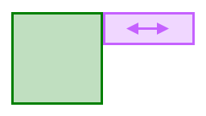

+++
title = "Ghost Collisions"
date = "2023-10-03T10:45:26-04:00"
description = "How to solve the 2D physics ghost collision problem in Box2D with presolve hooks."
tags = ["box2d", "c++", "godot", "winterpixel", "goober dash"]
draft = false
+++

# Another solution to the 2D platformer Ghost Collision problem

In this post I'll be explaining what the ghost collision issue is, walking through several existing ways to solve the problem, and a new solution I've come up with that I think is better than everything I've found online.

I developed this solution as part of my work at Winterpixel Games, during the early development of Goober Dash (which you can play [here](https://gooberdash.winterpixel.io)).

As always, there are caveats and pros/cons to everything, so maybe this isn't perfect for your project. But hopefully I can expand on the literature and provide something new.

[Skip to The Solution](#the-solution)

## What are "ghost collisions"?

Essentially, ghost collisions are a common bug when building 2D platforming levels where your player can get stuck while walking on a surface made of multiple pieces of geometry.

 

This issue doesn't occur all the time - only when the player is positioned _just right_ to get stuck on a corner.

This is caused by the nature of the Box2D collision solver.
When two convex shapes collide, Box2D requires a small overlap between them . The contact points and normals are then calculated based on the geometry of the shapes and the penetration. However, there is a rare possibility that the geometry aligns perfectly to create a horizontal contact normal, which causes the player's physics body to get stuck.

\
_(image from iforce2d)_

Here we can clearly see the difference between the two situations. In the first, the contact normal is pointing up, and the player is able to move freely as expected. In the second, the contact normal is pointing horizontally, blocking the player from moving.

**Note:**\
For the context of this post, I want to clarify that we're working with rigid body player controllers. It is common to instead use kinematic bodies, handling all the collision mechanics yourself, but I'm not a fan of this method for plenty of reasons. At Winterpixel Games, we were able to successfully create a tight, responsive, and fun player controller using exclusively rigid bodies. This was necessary because our games involve interactive multiplayer with a lot of natural physics interactions, such as pushing blocks and other players around.

## Existing solutions

I'm aware of three solutions to ghost collisions documented online. If you want to read more about them, links are provided throughout.

### Solution 1. Clipped Corners

The easiest solution is to clip the corners of the player's collision shape. This prevents the player from getting completely stuck on corners.

\
_(image from iforce2d)_

Pros:
- Very simple to implement
- Prevents the worst case scenario (player completely stuck)

Cons:
- Can cause the player to "hop" and change velocity when moving between two surfaces. This can have severe effects if the player is moving quickly.
- Players standing on the edge of a platform can slip off the edge, if friction is not handled carefully.

Another form of the clipped corners solution is to use pill, or capsule shapes for the player collision.

Read more about this solution [here](https://www.iforce2d.net/b2dtut/ghost-vertices).

### Solution 2. Box2D Chain Shapes

Box2D provides a solution to the ghost collision problem in the form of chain shapes. This is intended to solve a slightly different scenario created by two edge shapes rather than two convex polygons.

I won't explain here how chain shapes work (instead see [Erin Catto's blog](https://box2d.org/posts/2020/06/ghost-collisions/)), but in summary, chain shapes allow you to specify a sequence of edges with **ghost vertices** to define geometry for terrain, where the contact normals are calculated differently to handle this special case, preventing the player from getting hung up on corners.

Pros:
- Properly handles ghost collisions
- Built-in solution, no extra code required

Cons:
- Contiguous chunks of terrain must be defined as a single chain shape. This can be difficult to work with, especially if you want to use a tilemap or other level editor. The most straightforward solution I can imagine is using [Clipper2](https://github.com/AngusJohnson/Clipper2) to join all the geometry with polygon clipping.

### Solution 3. Polygon clipping

As just mentioned, you can join geometry together using polygon clipping. This is a very powerful solution, but requires another dependency and can have performance implications.

You don't have to use chain shapes for this. You can instead use convex polygons if you spend the effort to decompose concave N-gons into convex 8-gons as I have implemented [here](https://github.com/winterpixelgames/godot_box2d/blob/fc3e09e648ab1d42e8a3f18ee55408619950a067/scene/resources/box2d_shapes.cpp#L300-L385), but this is a bit more complicated.

Pros:
- Removes all adjacent edges, preventing ghost collisions
- Allows you to use any geometry you want, including tilemaps

Cons:
- Requires another dependency
- Can be performance intensive if you have a lot of geometry to join

## Why do we need another solution?

If you've worked on a platformer game before, you might already know what's missing. There are so many features we haven't considered yet.

### My additional requirements:

While working on Goober Dash, I needed a solution that:
1. Is performance friendly (no polygon clipping on the server)
2. Is transparent to level designers (no clipping corners, no handcrafted chain shapes)
3. Allows using multiple shapes/bodies with different collision properties/callbacks\
(moving platforms, one-way platforms, dynamic objects and boxes, etc.)

Interesting to note: that last requirement hasn't been mentioned before in anything I've read online. Surely I'm not the first to deal with it?

Let's visualize this third requirement.

Moving platforms, anyone? Often they line up perfectly with the terrain, creating opportunity for the ghost collision scenario. You can't raise/lower the height of the platform, because then the player will surely hit a corner going the other way.



How about one-way platforms? These require special pre-solve callbacks to disable collisions depending on the player's position and velocity. There is no way to do this with chain shapes or clipped corners, because we need entirely distinct physics bodies.

These features are critical to any platformer, and they are ripe to produce the ghost collision scenario we're trying to fix.


## The Solution

So, what is the solution? It's actually quite simple. We can use a presolve callback to detect the ghost collision scenario and disable the collision.

We filter contacts that meet the following criteria:
- Face-face collision (two contact manifold points)
- contact normal opposes the player's velocity
- contact points are very close together (contact area is very small)

Because these contacts cover such a small area, we can safely disable the collision for one frame without any noticeable side effects. Once the two bodies have a larger contact area, the collision will be re-enabled and the solver will de-penetrate the bodies.

Here's the code:
```cpp
void PreSolve(b2Contact* contact, const b2Manifold* oldManifold) {
    b2WorldManifold worldManifold;
    contact->GetWorldManifold(&worldManifold);

    b2Fixture* fixture_a = contact->GetFixtureA();
    b2Fixture* fixture_b = contact->GetFixtureB();
    b2Body* player_body = ...; // check body userdata
    b2Vec2 normal = ...; // terrain->player normal. orient depending on which fixture is the player

    // Prevent snags (ghost collisions) for face-face collisions
    if (b2Dot(normal, player_body->GetLinearVelocity()) >= 0.0) {
        if (worldManifold.pointCount > 1) {
            float dist = (worldManifold.points[0] - worldManifold.points[1]).Length();
            // dist threshold needs to be at least `2.0 * b2_linearSlop`
            // for wiggle room let's double it
            if (dist < 4.0 * b2_linearSlop) {
                contact.SetEnabled(false); // only disabled for 1 frame
            }
        }
    }
}
```
_(This code interfaces with [a module I wrote some years ago](https://github.com/winterpixelgames/godot_box2d) before I joined Winterpixel, integrating Box2D with Godot Engine. The code here has been modified from the source for clarity.)_

Notes:
- The `normal` vector must be oriented correctly. Box2D will provide the collision bodies for each callback in an arbitrary orientation, so you need to check whether the player is `fixture_a` or `fixture_b`.
- I haven't used this with anything other than rectangles. You may still deal with ghost collisions with point-face collisions with triangles or other polygons.
- This approach might work for other platformer problems, like [fudging corner collisions](https://twitter.com/MaddyThorson/status/1238338579513798656). I expect this should work if you simply increase the distance threshold.

Let me know if I got anything wrong, or if you've seen this solution before.\
Thanks for reading.
