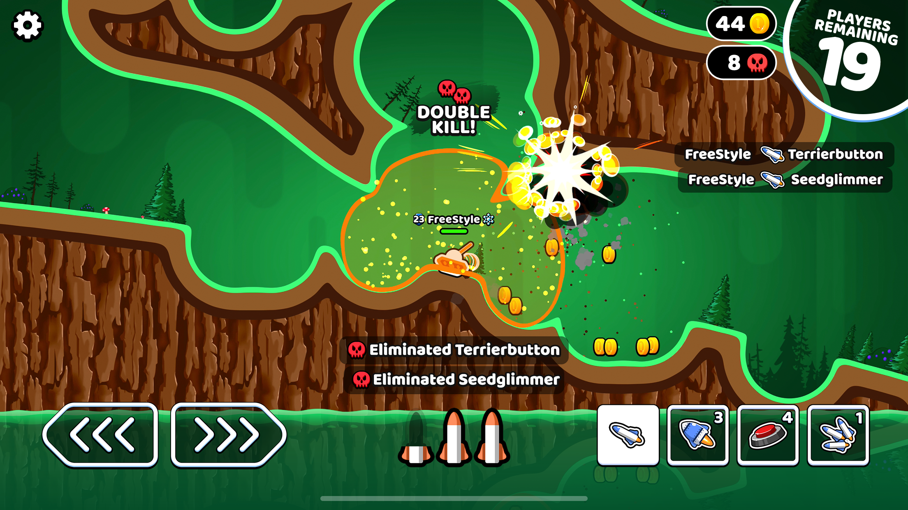
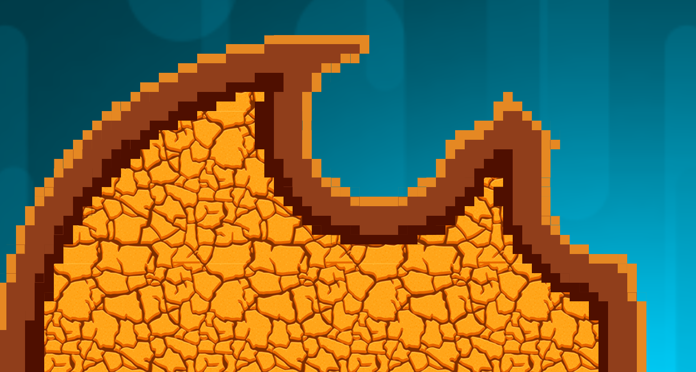
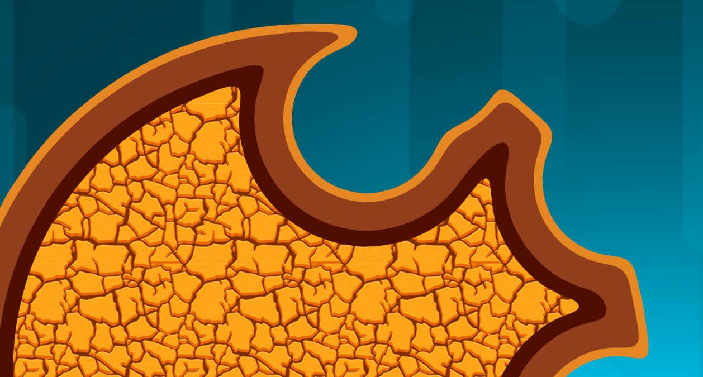
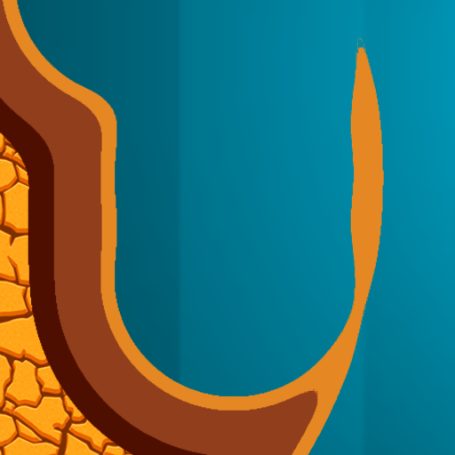
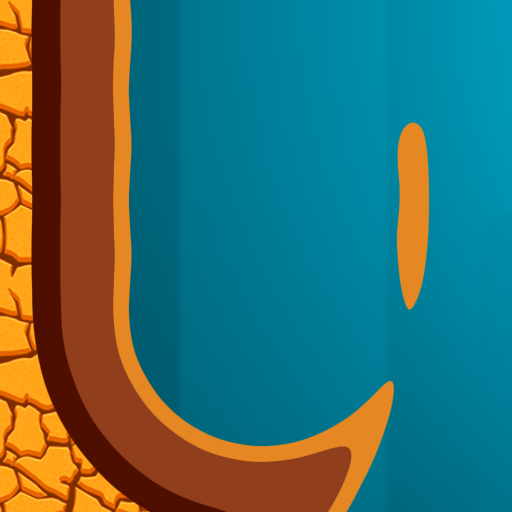
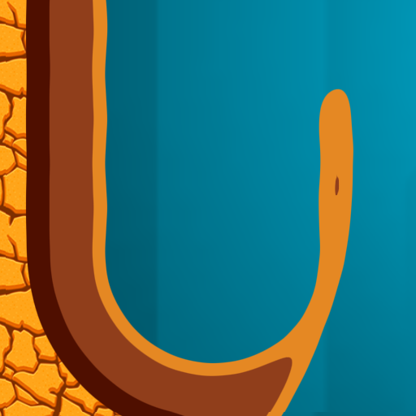
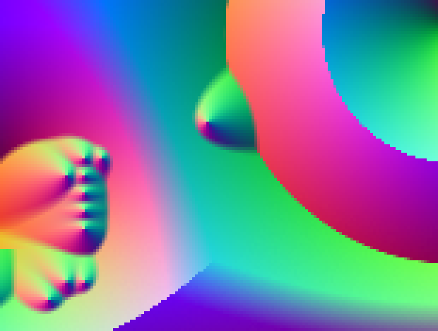
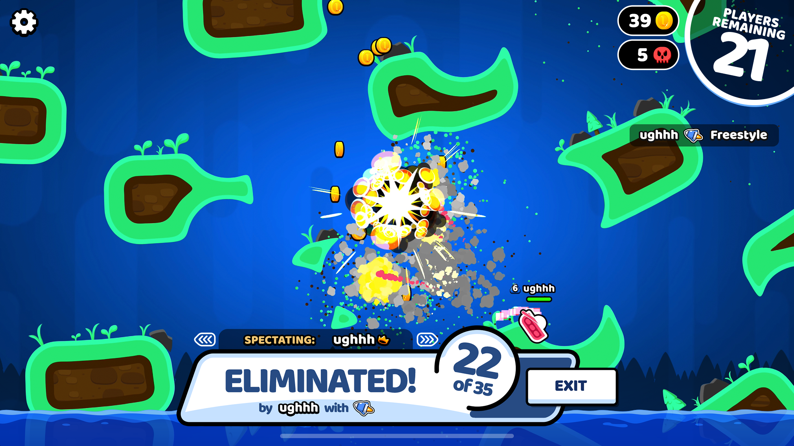

+++
title = "SDF Rendering Optimization"
date = "2025-10-19T09:40:46-04:00"
description = ""
tags = ["godot","rendering","sdf","winterpixel","optimization"]
draft = false
unsafe = true
+++

While working on games at Winterpixel, I had the opportunity to solve a variety of interesting and satisfying problems. One of my favorites was optimizing the real-time SDF renderer for destructible terrain.

## A Little Bit of Context

### The Game

[Rocket Bot Royale](https://rocketbotroyale.winterpixel.io/) is an online multiplayer battle royale, reminiscent of Worms. You drive a tank around the terrain, shoot other tanks, and hopefully survive long enough to secure victory. The core mechanics of this game use Signed Distance Fields (SDFs, also known as Signed Distance Functions). This is what enables terrain rendering, terrain collision, the "anti-grav" feature that sticks tanks to the underside of the terrain, and other interesting visual effects.



Every level is uniquely designed using SDF functions. Many of the original levels were developed in raw GLSL shaders (with great help from [Inigo Quilez](https://iquilezles.org/articles/distfunctions2d/)'s articles), though after some time we began creating levels using a custom built node-based code generator for faster development.

There are other games that use SDFs encoded with images rather than functions. However, this approach would not have been trivial to use in Rocket Bot Royale due to the size of the levels and the requirement for network synchronization of destructible terrain.

<!-- While these function-based SDFs aren't great for creating content quickly and creatively, they are relatively performant for both collision detection on the CPU and for rendering on the GPU. These functions are branchless and free of memory reads. They also enable creating polished visual effects like these: -->

Destructible terrain can also be implemented using polygons and polygon clipping libraries, such as [clipper2](https://github.com/AngusJohnson/Clipper2). This would typically be the "sane" approach, but that would make polished effects like these much more difficult to implement:

| Smooth deformation (0.125x speed) | Adaptive rendering |
|---|---|
|  |  |
<!--  -->

### Performance impacts of destructible terrain

Hardcoded SDF functions can be very performant, because they require no memory reads or branching. Unfortunately, to implement destruction, we need to access data about all nearby explosions to compute the final SDF.

This means SDF rendering on the GPU cannot be made branchless or free of memory reads. When including Chromebooks in your target hardware, this becomes a significant performance problem.
<!-- 
*(This is improved by the approach of storing explosions on a regular grid, creating an upper bound for total explosions in a given space, therefore limiting memory reads per pixel. But with large maps and lots of destruction, this still adds up quick.)* -->


## Optimization
### Low-resolution SDF rendering

One of the intrinsic properties of SDFs is that they can encode exact sub-pixel-precision distances. They essentially encode a reasonable approximation of the boundary of a shape, rasterized to a grid. This is massively useful for font rendering with dynamic scales.

By reading the texture using a bilinear filter, you can render clean geometry by thresholding at the "zero" point, typically a value of `0.5`.

<br>
*Source: [msdfgen GitHub](https://github.com/Chlumsky/msdfgen?tab=readme-ov-file#multi-channel-signed-distance-field-generator)*


We can use this same technique to reduce the total rendering cost of our terrain. By reducing the total render resolution of the SDF texture, we can reduce the impact of performing texture reads within branched code regions. In Rocket Bot Royale, we use a 1/16 scale factor. That means **256x fewer total pixels** to render in the expensive SDF pass. Though, we still require a full screen pass with a couple texture reads to draw the final image.

| 1/16 scale, raw&nbsp;&nbsp;&nbsp;&nbsp;&nbsp;&nbsp;&nbsp;&nbsp;&nbsp;&nbsp;&nbsp;&nbsp;&nbsp;&nbsp;&nbsp;&nbsp;&nbsp;&nbsp; | 1/16 scale, final implementation |
|---|---|
|  |  |

In our testing on multiple platforms including iOS, HTML5, and desktop, with this technique we measured a **~15% total frametime reduction**. Pretty good! Though honestly, these aren't the massive savings I was hoping for. The final full screen render pass is unavoidably expensive.

While this is a great improvement, not all gains are free. Undersampling creates two problems:

### Problem 1. Interpolation artifacts

Using a standard bilinear filter creates an unpleasant, sharp aesthetic in some areas of the terrain. We can easily fix this by simply using a [bicubic filter](https://en.wikipedia.org/wiki/Bicubic_interpolation).

| Bilinear filter ❌ | Bicubic filter ✅ |
|---|---|
|  |  |

This requires three additional texture reads. Bilinear filtering is typically hardware accelerated, while the bicubic filter is not. If dealing with particularly GPU-limited hardware, this may be worth disabling.


### Problem 2. Information loss

By rendering to a significantly reduced resolution, we risk losing critical information due to undersampling. You can relate this to the [Nyquist–Shannon sampling theorem](https://en.wikipedia.org/wiki/Nyquist%E2%80%93Shannon_sampling_theorem), though these are not entirely the same problem.

This issue reveals itself when encountering thin or small geometry, demonstrated below. Because the SDF physics on the CPU is completely independent from our downsampled SDF rendering technique, geometry that impacts gameplay may become invisible.

To solve this, I use an approach I call **subpixel reconstruction**.

| Original (no scaling)&nbsp;&nbsp;&nbsp;&nbsp;&nbsp;&nbsp;&nbsp;&nbsp; | 1/16 scale ❌&nbsp;&nbsp;&nbsp;&nbsp;&nbsp;&nbsp;&nbsp;&nbsp;&nbsp;&nbsp;&nbsp;&nbsp;&nbsp;&nbsp;&nbsp;&nbsp;&nbsp; | With reconstruction ✅ |
|---|---|---|
|  |  |  |

Subpixel reconstruction uses vector calculus to identify pixel boundaries that are more likely to have geometry inside, to account for features too small to be rasterized. If we find a suspicious pixel, we add the radius of one texel to the SDF at that point to make the terrain just barely reappear.

This requires computing several gradients. We first compute the first-order gradient vector in the downsampled SDF pass, which can then be conveniently packed into the color channels of the SDF texture to pass along.

*Note: The GLSL built-in functions `dFdx`/`dFdy` are insufficient because the typical implementation uses 2x2 pixel fragments to calculate the gradient, which would half the effective resolution of our field.*

Here is an example output of the low-resolution SDF pass:


Subpixel reconstruction is performed in a second pass, again using a 1/16 scale resolution. Here, we calculate the second-order gradient using the gradient from the first pass. **This second-order gradient describes the curvature of the original SDF function.** This can be used as a strong indicator for sharp or thin geometry. Using this as a heuristic, we pad the SDF in these regions that are more likely to suffer from undersampling.


During development, I experimented with two methods:

#### Method 1. Second partial derivative test ❌

By checking for [critical points](https://en.wikipedia.org/wiki/Second_partial_derivative_test) in the SDF, we theoretically should be able identify local minima and saddle points. This requires computing the full [Hessian matrix](https://en.wikipedia.org/wiki/Hessian_matrix).

```glsl
float det = grad_xx * grad_yy - grad_xy * grad_yx;
float discriminant = max(det, 0) * sign(grad_xx);
if (discriminant > 0.0)
    sdf_distance -= discriminant * pixel_size;
```

In practice, this method did not yield the best results.

#### Method 2. Divergence heuristic ✅

Another way to look for local minima is to measure the gradient [divergence](https://en.wikipedia.org/wiki/Divergence). This doesn't require computing the mixed partial derivatives.

```glsl
float discriminant = clamp( sign(grad_xx)*grad_xx*grad_xx + sign(grad_yy)*grad_yy*grad_yy, 0, 1 );
if (discriminant > 0.0)
    sdf_distance -= discriminant * pixel_size;
```

This method yielded the best overall results. Looking back, I am curious to find that our implementation squares the gradient. This is clearly more of an art than a science.

I'm sure there are better solutions to this problem, but I find that once you find a solution that's just good enough, sometimes it's best to move on.
Thanks for reading!

